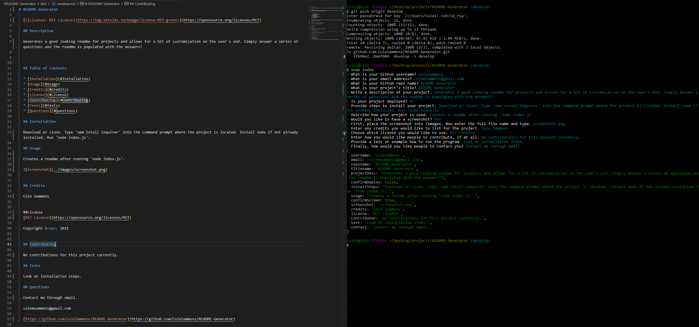

# readme generator

  

  ## Description 

  generates readme

  
  [google.com](google.com)
  

  ## Table of Contents

  * [Installation](#installation)
  * [Usage](#usage)
  * [Credits](#credits)
  * [License](#license)
  * [Contributing](#contributing)
  * [Tests](#tests)
  * [Questions](#questions)
   
  ## Installation
  
  install project
  
  ## Usage

  how used
  
  
  

  ## Credits

  Cole Sammons

  
  ##License
  [MIT License](https://opensource.org/licenses/MIT)

  Copyright &copy; 2021
  

  ## Contributing

  No contribution

  ## Tests

  no current tests

  ## Questions

  email

  cole@gmail.com

  [https://github.com/ColeSammons/readme-generator](https://github.com/ColeSammons/readme-generator)
